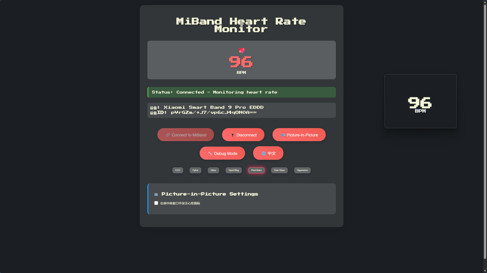
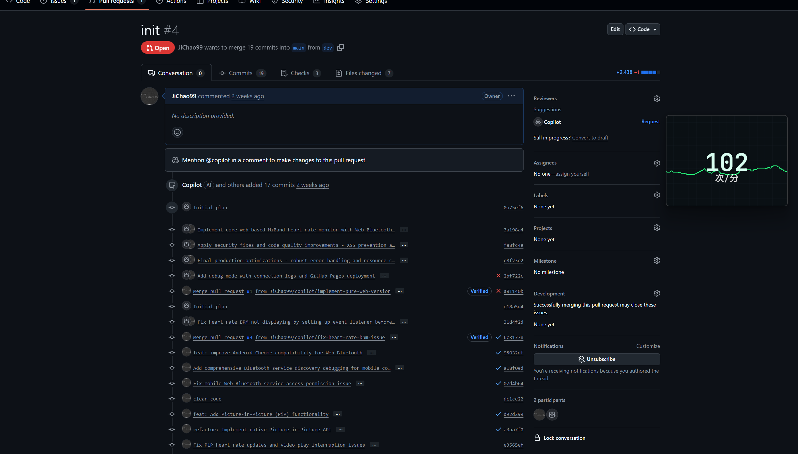
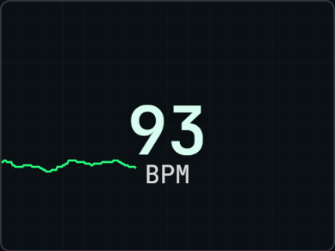
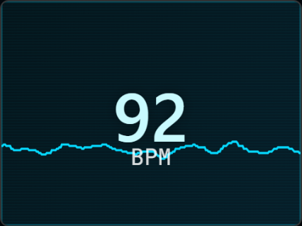
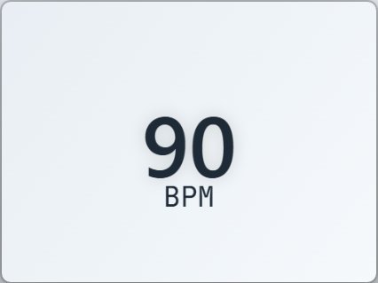
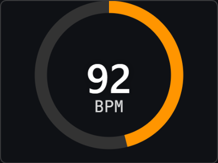
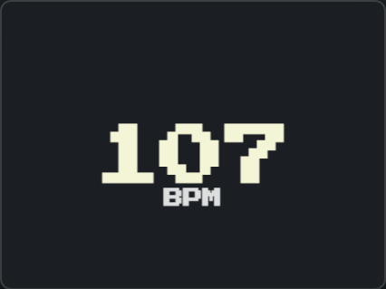
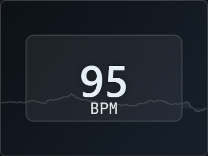
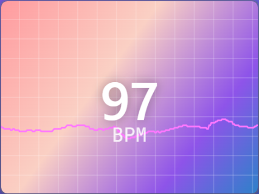

# MiBand Heart Rate Web

> 🌐 A pure web version of MiBand heart rate monitor based on [Tnze/miband-heart-rate](https://github.com/Tnze/miband-heart-rate)

A web-based application for reading real-time heart rate data from Xiaomi Smart Band devices using Web Bluetooth API. No installation required - just open in your browser!

**🚀 Live Demo:** [https://jichao99.github.io/miband-heart-rate-web/](https://jichao99.github.io/miband-heart-rate-web/)

**📖 中文版本:** [README.zh.md](./README.zh.md)

## 🖼 Demo Screenshots

Large previews (full images):





Theme preview thumbnails

| Theme | Screenshot | Description |
|-------|------------|-------------|
| ECG |  | Medical dark monitor with green waveform & grid |
| Cyber |  | Neon gradient with scanlines & glowing waveform |
| Glass |  | Light frosted minimal panel |
| Sport Ring |  | Animated percentage ring around BPM |
| Pixel Retro |  | Retro pixel font styling |
| Dark Glass |  | Dark frosted glass panel over gradient |
| Vaporwave |  | Pastel pink/purple/teal gradient with waveform |


## ✨ Features

- 🔗 **Direct Browser Connection** - No app installation needed
- 💖 **Real-time Heart Rate** - Live BPM monitoring with animated display
- 📊 **Sensor Contact Detection** - Shows if the band is properly worn
- 🎨 **Beautiful UI** - Modern gradient design with smooth animations
- 🔄 **Auto-reconnect** - Handles connection drops gracefully
- 📱 **Mobile Friendly** - Works on mobile browsers too
- 🔧 **Debug Mode** - Advanced debugging with connection logs and statistics
- 🌐 **Bilingual Support** - Chinese and English interface with auto-detection
- 📺 **Picture-in-Picture** - PiP mode for heart rate display
- 🎨 **Multi Themes** - ECG grid, Cyber neon, Glass, Sport ring, Pixel retro, Dark Glass, Vaporwave (switchable & bilingual labels)

## 🚀 Quick Start

1. **Enable Heart Rate Broadcast** on your MiBand:
   - Go to MiBand settings → Heart Rate → Enable "Heart Rate Broadcast"

2. **Open the web app**:
   - Serve the files over HTTPS (required for Web Bluetooth)
   - Or simply open `index.html` in Chrome/Edge

3. **Connect your device**:
   - Click "Connect to MiBand"
   - Select your device from the Bluetooth dialog
   - Start monitoring your heart rate!

## 🔧 Technical Requirements

### Browser Support
- ✅ Chrome 56+ (Windows, macOS, Linux, Android)
- ✅ Edge 79+ (Windows, macOS)
- ❌ Firefox (Web Bluetooth not supported)
- ❌ Safari (Web Bluetooth not supported)

### Connection Requirements
- 🔒 **HTTPS required** (Web Bluetooth security requirement)
- 📡 **Bluetooth 4.0+** on your computer/device
- 🏃‍♂️ **MiBand with Heart Rate Broadcast enabled**

## 📱 Supported Devices

**Tested on:**
- MiBand 9 Pro ✅
- MiBand 10/NFC ✅

**Should work with:**
- MiBand 4, 5, 6, 7, 8, 9, 10 (all models with heart rate broadcast)

## 🛠️ Development

### Local Development Server

For local development, you can use HTTP for basic testing, but HTTPS is required for Picture-in-Picture functionality. Use one of these methods:

```bash
# Using Python 3
python -m http.server 8080 --bind localhost

# Using Node.js (http-server)
npx http-server -p 8080 -a localhost

# Using PHP
php -S localhost:8080

# Using the included Node.js server
node server.js
```

Then access via `http://localhost:8080` (for HTTPS setup, see PiP requirements below).

### File Structure
```
miband-heart-rate-web/
├── index.html          # Main HTML interface
├── script.js           # Web Bluetooth implementation & internationalization
├── server.js           # Local development server
├── README.md           # English documentation (this file)
├── README.zh.md        # Chinese documentation
└── ...
```

## 🔌 Web Bluetooth Implementation
## 🎨 Theme Styles

You can switch visual styles in the UI (buttons under the language toggle):

| Theme | Description | PiP Rendering |
|-------|-------------|---------------|
| ECG | Dark medical monitor with green waveform & grid | Real-time line waveform + BPM |
| Cyber | Neon gradient + scanlines | Glowing waveform + BPM |
| Glass | Light frosted minimal | Large clean number + BPM label |
| Sport | Dark background + progress ring | Animated ring showing HR percentage of 200 BPM |
| Pixel | Retro pixel font | Pixel-style number + BPM |
| Dark Glass | Dark frosted glass panel over deep gradient | High-contrast number inside translucent panel |
| Vaporwave | Pastel pink/purple/teal gradient + grid | Waveform + neon number |

Keyboard shortcuts (Ctrl+1..7) also switch themes quickly when the page is focused.

Picture-in-Picture adapts to the selected theme, drawing waveform or ring accordingly. Heart rate history (~last 240 samples) is used for wav rendering.

> Tip: Use keyboard shortcuts Ctrl+1..7 to switch themes quickly while focused on the page.


This implementation replicates the Rust version's functionality using Web Bluetooth API:

- **Heart Rate Service UUID**: `0x180D`
- **Heart Rate Measurement UUID**: `0x2A37`
- **Data parsing**: Same bit-field parsing as original Rust code
- **Auto-reconnect**: Handles connection drops like the original's loop

## � Internationalization

The application supports bilingual Chinese/English interface:

- 🔍 **Auto-detection**: Automatically selects language based on browser settings
- 🔄 **Manual toggle**: Click the 🌐 button to switch between languages
- 💾 **Persistent preference**: Language choice is saved to local storage
- 🎯 **Complete translation**: All UI text, error messages, and debug info are bilingual

## 📺 Picture-in-Picture Support

Picture-in-Picture mode for heart rate display:

- 🖼️ **Real-time display**: Shows live heart rate in a small window
- 🎨 **Beautiful interface**: Gradient background with clear typography
- 💖 **Optional icon**: Toggle heart icon display in PiP window
- ⌨️ **Keyboard shortcuts**: Ctrl+P to toggle PiP mode
- 🔒 **HTTPS required**: PiP API requires secure context

### HTTPS Setup for PiP

Picture-in-Picture requires HTTPS. For local development:

1. **Browser flags** (easiest):
   - Chrome: Enable `chrome://flags/#allow-insecure-localhost`
   - Edge: Enable `edge://flags/#allow-insecure-localhost`

2. **Use included server with flags**:
   ```bash
   node server.js
   # Then use browser flags above
   ```

3. **Deploy to GitHub Pages** (automatic HTTPS)

4. **Use ngrok for tunneling**:
   ```bash
   npx ngrok http 8080
   ```

## �🆚 Comparison with Original

| Feature | Rust Version | Web Version |
|---------|-------------|-------------|
| Platform | Windows/macOS/Linux | Any modern browser |
| Installation | Compile from source | No installation |
| Bluetooth API | bluest crate | Web Bluetooth API |
| UI | Terminal output | Beautiful web interface |
| Heart Rate Display | Text only | Animated with BPM |
| Sensor Contact | Text output | Visual indicators |
| Reconnection | Automatic loop | Auto-reconnect logic |
| Language Support | Single language | Bilingual (Chinese/English) |
| Picture-in-Picture | None | Supported |

## 🐛 Troubleshooting

### "Web Bluetooth not supported"
- Use Chrome or Edge browser
- Ensure you're on HTTPS (not HTTP) for production

### "Bluetooth not available"
- Enable Bluetooth on your device
- Grant Bluetooth permissions when prompted

### "Device not found"
- Make sure MiBand heart rate broadcast is enabled
- Ensure MiBand is not connected to another app
- Try restarting Bluetooth on your device

### "Picture-in-Picture not working"
- Ensure you're using HTTPS protocol
- Enable browser flags for localhost (see HTTPS Setup above)
- Chrome: Enable `chrome://flags/#allow-insecure-localhost`
- Edge: Enable `edge://flags/#allow-insecure-localhost`

### Connection drops frequently
- Keep MiBand close to your device
- Ensure MiBand has sufficient battery
- Close other Bluetooth apps that might interfere

## 💡 Usage Tips

### Keyboard Shortcuts
- `Ctrl + P`: Toggle Picture-in-Picture mode
- `Ctrl + H`: Toggle heart icon in PiP window (when PiP is active)

### Debug Mode
Enable debug mode to:
- View detailed connection logs
- Monitor heart rate update statistics  
- Test Picture-in-Picture functionality without device connection

### Language Switching
- Click the 🌐 button to switch between Chinese and English
- Language preference is automatically saved
- First visit automatically detects browser language

## 📄 License

This project is inspired by and based on [Tnze/miband-heart-rate](https://github.com/Tnze/miband-heart-rate).

## 🤝 Contributing

Feel free to submit issues and pull requests to improve this web version!

---

**Note:** This is a web adaptation of the original Rust implementation. For the native desktop version, check out the [original repository](https://github.com/Tnze/miband-heart-rate).